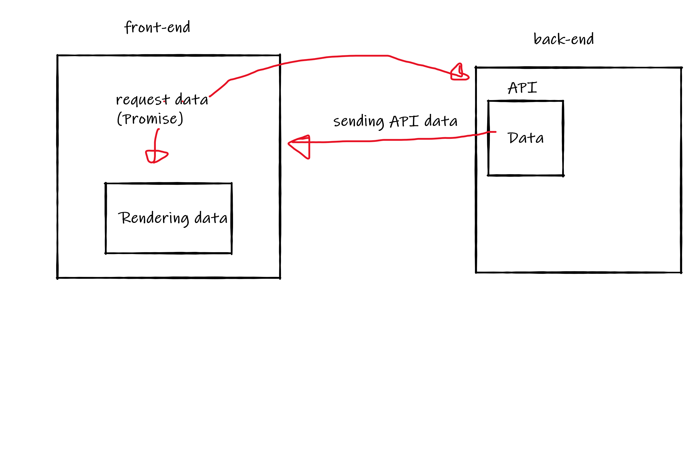
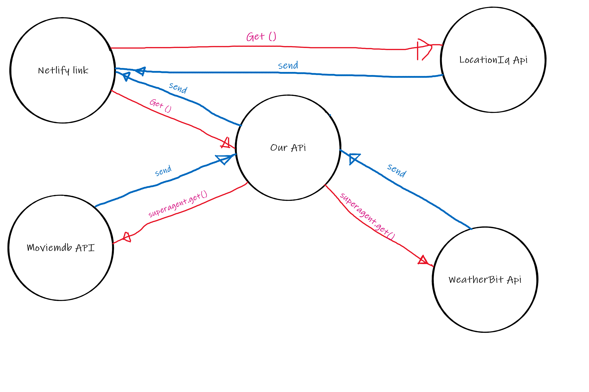
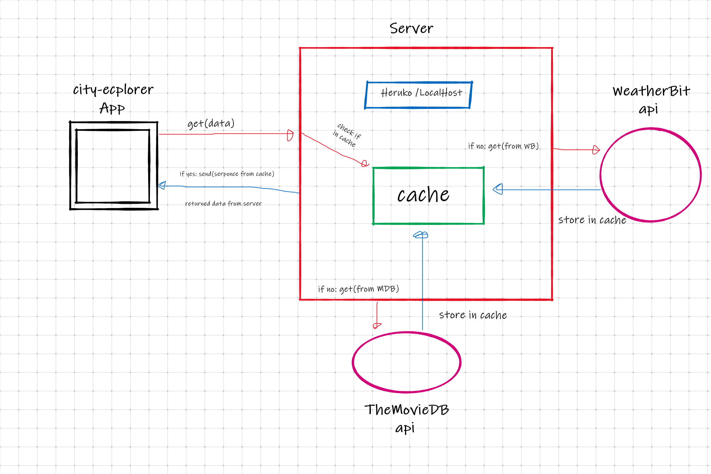

# City Explorer

**Author**: Hatem Ghazi Husnieh
**Version**: 1.2.2

## Overview
This is an application that uses an `API` to display a location of users choice. and shows the forecast of the location for the next 20 days. Also, now it has the ability to offer a collection od movies related to the city that been explored. 

- It now store the search results in the **cache**, and if the same search was made again, it will send the results from the cache.

## Getting Started
1. install a React template
1. build the structure of the app
1. find an API and get a key
1. import `axios` into your react app
1. identify the parts in the API URL that need to be changed in the `GET API link` to be useful
1. create functions to change the API parts.
1. render your app
1. connect thr front end to NETLIFY.com
1. connect the Back-End to HEROKU.com
1. refactor the code and get rid of any unnecessary states, if-statements and variables. 
1. make a cache protocol, so when a search is made, the results are stored in the cache

## Architecture
- react library
- axios library
- react.bootstrap library
- CSS
- JavaScript
- HTML
- JSON 
- Express.js
- Node.js
- LocationIQ API
- Weather-BIT API
- TheMovie-DB API

## Change Log
- 02.05.2021 12:00am - application now has a fully-functional express server, with a GET route for the location resource. 

- 04.05.2021 10:00pm - application now preview a static forecast for 20 days

- 05.05.2021 11:30pm - application can preview future forecasts along with collection of movies related to location.

- 06.05.2021 4:00pm - application can store search results in cache, and if the same search is made again, the results will be sent from the cache instead of the api.
 

## Credit and Collaborations
- **ASAC** team
- [LocationIQ](https://locationiq.com/)
- [Qusay Al-Amarat](https://github.com/Qusay114)
- [Mohammad Khaled Jaradat](https://github.com/muhmadJaradat)

Name of feature: **Asynchronous code, and APIs**

Estimate of time needed to complete: 4 hours

Start time: 9:00 pm

Finish time: 12:00 am

Actual time needed to complete: 3 hours  

-------------------------

Name of feature: **Custom Servers with Node and Express**

Estimate of time needed to complete: 5 hours

Start time: 3:00 pm

Finish time: 9:00 pm 

Actual time needed to complete: 6 hours

-------------------

Name of feature: **APIs (Weather & Movies)**

Estimate of time needed to complete: 4 hours

Start time: 4:00 pm

Finish time: 12:00 pm 

Actual time needed to complete: 4 hours

---------------------

Name of feature: **Refactoring into Modules**

Estimate of time needed to complete: 3 hours

Start time: 1:30 am

Finish time: 3:00 am 

Actual time needed to complete: 1 hour and 30 minutes

--------------------

Name of feature: **cache memory**

Estimate of time needed to complete: 2 hours

Start time: 1:00 pm

Finish time: 2:30 pm 

Actual time needed to complete: 1 hour and 30 minutes
